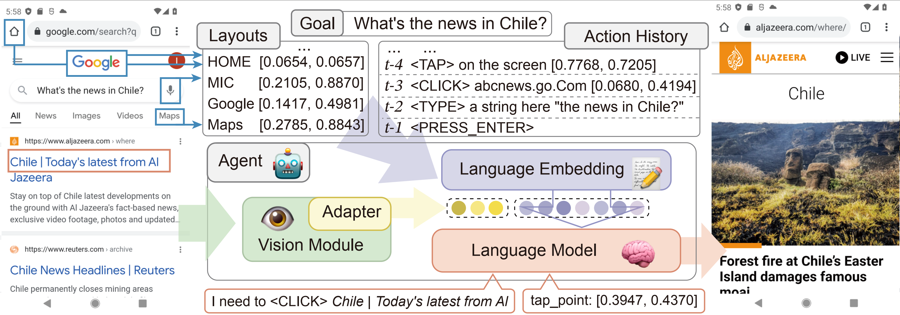

# CoCo-Agent

**CoCo-Agent: A Comprehensive Cognitive LLM Agent for Smartphone GUI Automation** [[paper]](https://arxiv.org/abs/2402.11941)

Accepted by ACL’24 Findings.
Code for my CoCo-Agent. 

Large language models (LLMs) have shown remarkable potential as human-like autonomous language agents to interact with real-world environments, especially for graphical user interface (GUI) automation. However, those GUI agents require comprehensive cognition ability including exhaustive perception and reliable action response. We propose Comprehensive Cognitive LLM Agent, CoCo-Agent, with two novel approaches, comprehensive environment perception (CEP) and conditional action prediction (CAP), to systematically improve the GUI automation performance. First, CEP facilitates the GUI perception through different aspects and granularity, including screenshots and complementary detailed layouts for the visual channel and historical actions for the textual channel. Second, CAP decomposes the action prediction into sub-problems: action type prediction and action target conditioned on the action type. With our technical design, our agent achieves new state-of-the-art performance on AITW and META-GUI benchmarks, showing promising abilities in realistic scenarios.



This repo will be improved continually.

```
@article{ma2024comprehensive,
  title={Comprehensive Cognitive LLM Agent for Smartphone GUI Automation},
  author={Ma, Xinbei and Zhang, Zhuosheng and Zhao, Hai},
  journal={arXiv preprint arXiv:2402.11941},
  year={2024}
}
```
